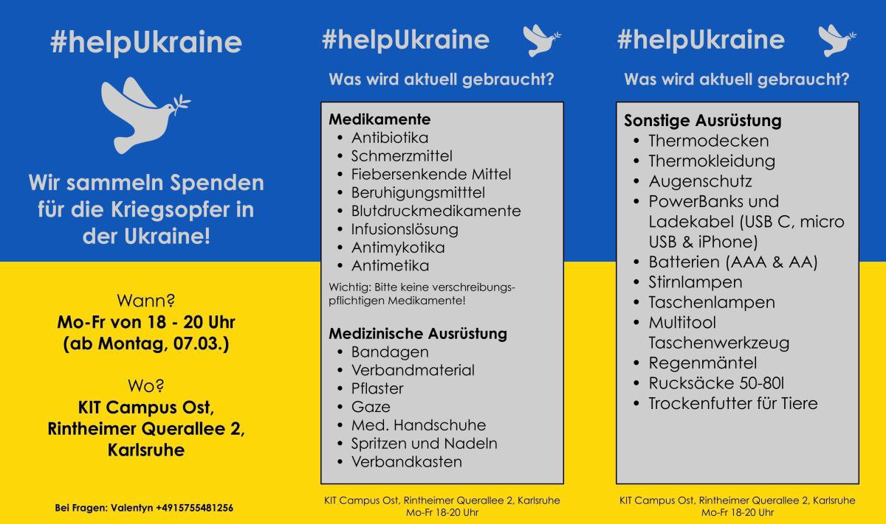

# #helpUkraine

**Herzlich willkommen! Wir sammeln Spanden für die Kriegsopfer in der Ukraine!**

## Wann?

**Mo-Fr von 18 - 20 Uhr**

## Wo?

**KIT Campus Ost, Rintheimer Querallee 2, Karlsruhe**

## Kontakte

Andrey: +491782126751
Anna: +4915171732969

## Aktuelle Liste

### MEDIKAMENTE
- fiebersenkende Medikamente (Paracetamol…)
- Schmerzmittel (Ibuprofen…)
- Mittel gegen Durchfall
- Mittel gegen Husten
- Einwegmasken/wiederverwendbare Masken
- Medizinische Handschuhe
- Halskrause
- Elastische Bandagen
- Spritzen
- Infusionssysteme
- Elektrolyten
- Auto-Verbandskästen
- Blutstillung (Celox)
- Blutdruckmessgeräte
- Tourniqueten (wie hier: https://www.zentauron.de/de/tourniquets/2869-skala-tourniquet.html)
- Atraumatische chirurgische Nadeln (Atraumatic surgical needles №2,3,4)
- Ventrikelkatheter (Ventricular catheters for drainage)
- Insulin
- Aceton-Teststreifen

### AUSRÜSTUNG
- Stirnlampe
- Batterien AAA, AA
- Schlafsäcke
- Thermosflasche 0.5-1L
- Isomatten (wie https://www.bergfreunde.de/schaumstoff-isomatten/)
- Walkie-Talkies
- Taschenlampen
- Fernglas
- Powerbanks + Kabeln (USB, USB-C, Lightning…)
- WD40
- Balaklava (Maske)
- Multi-Tool-Messer
- Tabletten zur Wasserdesinfektion

### LEBENSMITTEL
- Protein- Musli Riegel
- Trockenobst
- Reis
- Nudeln
- Dosenessen
- Tee
- Kaffee
- Baby-Trockennahrung
- Süßigkeiten für Kinder
- Schokolade
- Tierfuttern (am wichtigsten für Hunde)

### HYGIENEARTIKEL
- Waschpulver
- Feuchttücher
- Seife

### VERPACKUNGSMATERIAL
- Umzugskarton - wie viel wie möglich!
- Klebeband (transparent)
- Frischhaltefolie
- Textmarker, Kugelschreiber
- Papier Format A4
- Schere

**BITTE KEINE KLEIDUNG!**

(Kleidung ist schon genug. Wir dürfen leider gar keine mehr Kleidung zu der Grenze senden).

**Das WICHTIGSTE davon wären – Medikamente**

**WAS SICH NICHT EIGNET**

Essen, das schnell abläuft oder beim Transport beschädigt werden kann.
