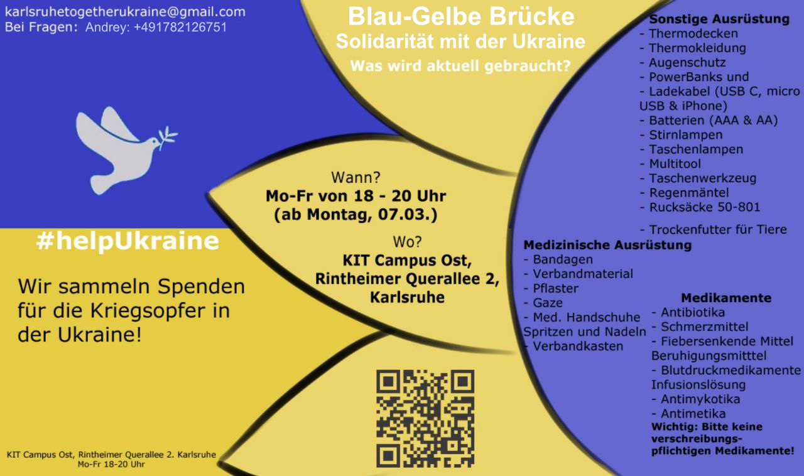

## Blau-Gelbe Brücke - Solidarität mit der Ukraine

**Herzlich willkommen! Wir sammeln Spenden für die Kriegsopfer in der Ukraine!**

### Anzeige

__DRINGEND:__

__Am Freitag werden humanitäre Güter für die Ukraine gesammelt! Das Fahrzeug fährt am Samstag in die Ukraine los, und zwar nach Kyiv und Kharkiv.__

Unsere Aufgabe ist es, das Fahrzeug mit Lebensmitteln (Konserven, Trockenwaren, Schokolade), hygienischen Waren (Zahnpasta, Seife, Damenbinden usw), Kindernahrung, Windeln, Isomatten, Schlafsäcke, Batterien, Taschenlampen, Thermoskannen, Männerschuhen u.ä. vollzupacken.

Wir haben bereits drei Autos nach Ukraine geschickt, und haben Video- und Fotobeweise über eine sichere Ankunft gekriegt, sowie Dankesbriefe.

__Die Hilfe wird am 1. April 9-20 Uhr am Unseren Lager gesammelt!__

__Adresse: Rintheimer Querallee 2, 76131 Karlsruhe (erkennbar an der ukrainischen Fahne rechts)__

Kontakte: 
Pavlo +49 1525 763 1966 (deutsch, ukrainisch, russisch, englisch) 
Irina +49 1514 528 2635 (englisch, russisch, ukrainisch) 
Anna +4915171732969 (russisch, deutsch, englisch) 

### Wann?

**Mo-Fr von 18 - 20 Uhr**

### Wo?

**KIT Campus Ost, Rintheimer Querallee 2, Karlsruhe**
([auf den Google Map](https://goo.gl/maps/njkCL8emVqZkPza36))

### Kontakte

[karlsruhetogetherukraine@gmail.com](mailto:karlsruhetogetherukraine@gmail.com) 
Valentin: +4915755481256 
Andrey: +491782126751 
Anna: +4915171732969 

### Aktuelle Liste

#### MEDIKAMENTE
- fiebersenkende Medikamente (Paracetamol etc)
- Schmerzmittel (Ibuprofen etc)
- Mittel gegen Durchfall
- Mittel gegen Husten
- Einwegmasken/wiederverwendbare Masken
- Medizinische Handschuhe
- Halskrause
- Elastische Bandagen
- Spritzen
- Infusionssysteme
- Elektrolyten
- Auto-Verbandskästen
- Blutstillung (Celox)
- Blutdruckmessgeräte
- Tourniqueten (wie hier: <https://www.zentauron.de/de/tourniquets/2869-skala-tourniquet.html>)
- Atraumatische chirurgische Nadeln (Atraumatic surgical needles №2,3,4)
- Ventrikelkatheter (Ventricular catheters for drainage)
- Insulin
- Aceton-Teststreifen

#### AUSRÜSTUNG
- Stirnlampe
- Batterien AAA, AA
- Schlafsäcke
- Thermosflasche 0.5-1L
- Isomatten (wie <https://www.bergfreunde.de/schaumstoff-isomatten/>)
- Walkie-Talkies
- Taschenlampen
- Fernglas
- Powerbanks + Kabeln (USB, USB-C, Lightning etc)
- WD40
- Balaklava (Maske)
- Multi-Tool-Messer
- Tabletten zur Wasserdesinfektion

#### LEBENSMITTEL
- Protein- Musli Riegel
- Trockenobst
- Reis
- Nudeln
- Dosenessen
- Tee
- Kaffee
- Baby-Trockennahrung
- Süßigkeiten für Kinder
- Schokolade
- Tierfuttern (am Wichtigsten für die Hunde)

#### HYGIENEARTIKEL
- Waschpulver
- Feuchttücher
- Seife

#### VERPACKUNGSMATERIAL
- Umzugskarton - so viel wie möglich!
- Klebeband (transparent)
- Frischhaltefolie
- Textmarker, Kugelschreiber
- Papier Format A4
- Schere

**BITTE KEINE KLEIDUNG!**

(Kleidung gibt es schon genug. Wir dürfen leider gar keine Kleidung mehr an die Grenze schicken).

**Das WICHTIGSTE davon wären die Medikamente**

**WAS SICH NICHT EIGNET**

Essen, das schnell abläuft oder beim Transport beschädigt werden kann.

### Links

#### Deutsch
- [Humanitäre Hilfe für Ukraine - Karlsruhe](https://t.me/+FiioV2UtYG0wNzA6)

#### Mehrsprachige Gruppen
- [Blau-Gelbe Brücke. Solidarität mit der Ukraine](https://t.me/+AONMSwz2i405MDQ6)
- [Gäste aus der Ukraine bei Karlsruhe](https://t.me/gostizukraini)
- [Ukraine Karlsruhe](https://t.me/ukraine_karlsruhe)
- [FAQ](https://ukraine-karlsruhe.github.io/FAQ/)
